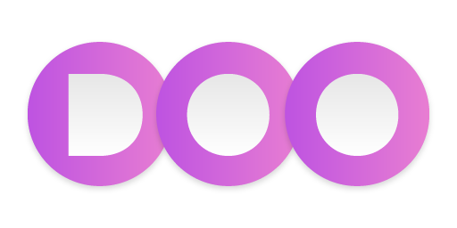

# Welcome to DOO Inc. 👋

  

## 🤖 About Us

DOO is an innovative AI coworker solution designed to enhance both Customer Experience (CX) and Employee Experience (EX). We help businesses automate routine tasks, optimize sales and customer service processes, and provide personalized interactions by seamlessly integrating AI with existing tools and workflows.

Our AI coworker learns your company's culture and adapts to your needs, delivering actionable insights from customer data across multiple channels like social media, CRM systems, and customer feedback. Scalable and adaptable, DOO empowers companies to make smarter decisions, improve operational efficiency, and drive business growth.

## 🚀 Software Development Kits

### React Native Package
Connect with the DOO CX platform using our [React Native SDK](https://github.com/doo-inc/doo-react-native-widget).

### Flutter Package
Connect with the DOO CX platform using our [Flutter SDK](https://github.com/doo-inc/doo-cx-flutter-sdk).

## 🤝 Contribution Guidelines

We welcome contributions from the community! If you'd like to get involved, please check out our individual repositories for more details.

## 📚 Useful Resources

For detailed documentation and additional resources, please visit our official website or check the README files in our individual repositories.

## 📞 Contact Us

- Email: dev@doo.ooo
- Phone: +1 (363) 333-2313

## 🏢 Legal Information

DOO Inc. is incorporated as in Delaware, United States, with operations under different names in Bahrain and Saudi Arabia.

## 🧙 Fun Fact

Did you know? Our AI coworker is so adaptable that it can learn your company's unique language and culture, making it feel like a true part of your team!

---

Made with ❤️ by DOO Inc.

